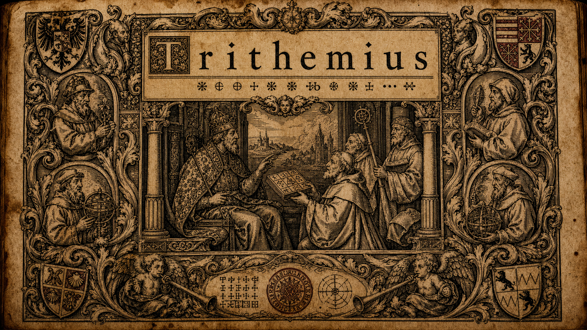

# Trithemius Corpus

[](https://trithemius-corpus.github.io/Trithemius-Corpus/)

[](LICENSE)
[](https://trithemius-corpus.github.io/Trithemius-Corpus/)
<!-- DOI badge added at v1.0 release: [](https://doi.org/10.5281/zenodo.XXXXXXX) -->

**Machine-assisted English translations of the Latin corpus of Johannes Trithemius (1462-1516): 29 distinct texts across 47 printed editions.**

Johannes Trithemius, Benedictine abbot of Sponheim and later Wurzburg, was a bibliographer, monastic reformer, cryptographer, historian, and one of the more idiosyncratic minds of the early German Renaissance. His cryptographic works attracted modern attention, but most of his monastic, Marian, hagiographic, pastoral, devotional, and historical writing has remained locked in early-modern Latin print.

This project translates **29 works across 47 printed editions** into English. Where several early printings of a text survive, each source witness was OCR'd and translated independently. The corpus is machine-produced, but it was also independently audited chunk by chunk against the Latin, remediated where the audit found fabrication or omission, and rebuilt into a public release view.

## What's in the corpus

Current public release view:

| Measure | Value |
|---|---:|
| Translatable works | **47** |
| Distinct texts | **29** |
| Published chunks | **4,400** |
| Public text origin | **Machine translation (all editions)** |
| Complete documented human review | **0 editions** |
| Public editorial status | **Provisional working texts** |
| Automated QA | **Triage evidence; not certification** |

Historical model-generated letter grades and numeric scores remain in the audit
data for reproducibility, but they are no longer used as public quality labels.
The current translations begin at internal triage status **C: provisional
machine translation** unless documented human comparison supports promotion.

Four additional source-manifest records are German or liturgical/table-heavy and are intentionally marked `skip: true` in `manifest.json`.

The older independent GPT-5.5 audit found real weaknesses in the first public draft: hallucinated passages, rough OCR-bound works, and several untranslated tail chunks. Those findings are preserved historically in [`METHODOLOGY.md`](METHODOLOGY.md). Later remediation repaired many identified defects, but machine agreement does not establish human-verified accuracy. Public review status is recorded in [`data/editorial_status.json`](data/editorial_status.json).

For a per-work table, source provenance, edition information, and grader statistics, see [`manifest.json`](manifest.json), [`data/_quality/scoreboard_gpt_v3.md`](data/_quality/scoreboard_gpt_v3.md), or the [browsable site](https://trithemius-corpus.github.io/Trithemius-Corpus/).

## How to read this

Each work lives at `works/<id>/` with:

- `english.md` - the stitched full English translation
- `latin-ocr.txt` - the OCR-cleaned Latin shown in the parallel viewer
- `intro.md` - a short researched headnote
- `metadata.json` - source provenance, historical machine-audit metadata, and artifact inventory
- `chapters.json` - chapter/navigation boundaries for the static site when available
- `ERRATA.md` - human correction notes when a work has recorded errata
- `chunks/` - per-chunk English markdown plus `grades.csv`

A synchronized Latin / English viewer, work pages, Style C cipher renderings, and full-text search are on the project site:

<https://trithemius-corpus.github.io/Trithemius-Corpus/>

The cryptographic and occult works carry extra **Special scholarly renderings** pages: cipher-key substitution tables, cipher-grid figures, recovered untranslated passages, and damage-preserving prose, shown beside original source-page facsimiles where available. The solved Clavis ciphers are summarized on the site's cipher-solutions page.

Start with [`METHODOLOGY.md`](METHODOLOGY.md) for the OCR, translation, grading, remediation, limitations, and reproducibility notes.

## What this is and is not

This is **a starting point for English readers and a scholarly aid**, not a replacement for a human critical edition. The translations are machine-produced. The grades are independent machine grades useful for triage and quality accounting; they do not certify that every individual passage is correct. For any passage you intend to quote in a published argument, check it against the Latin.

A few works already have published English translations and should be preferred for scholarly citation where applicable: *De Laude Scriptorum Manualium* (Roland Behrendt, 1974; Elizabeth Bongie, 1977), the *Steganographia* tradition (Stephen Skinner and Daniel Clark, 2024), and William Lilly's 1647 English version/adaptation of *De Septem Secundeis* as *The World's Catastrophe*. The full survey is in [`docs/PRIOR_TRANSLATIONS.md`](docs/PRIOR_TRANSLATIONS.md).

## Citation

```text
Fabin, Ian Carlos (2026). Trithemius Corpus: machine-assisted English translations
of a 47-work Latin corpus by Johannes Trithemius (1462-1516).
https://github.com/Trithemius-Corpus/Trithemius-Corpus
```

See [`CITATION.cff`](CITATION.cff) for a machine-readable citation record. A DOI will be registered via Zenodo for tagged releases.

## License

See [`LICENSE`](LICENSE) for full terms. The project has three layers of rights:

- **Latin source texts** - public domain.
- **Machine translations and generated corpus artifacts** - no copyright claimed; released as **CC0-1.0**.
- **Methodology, documentation, code, and corpus arrangement** - (c) 2026 Ian Carlos Fabin, licensed **CC BY 4.0**.

## Project status

- [x] Phase 1 - Foundation docs
- [x] Phase 2 - Content: public-domain retrieval rebuild, full translation, quality sweeps, and researched intros
- [x] Phase 3 - Presentation: static site, side-by-side viewer, Style C pages, facsimiles, and search
- [ ] Phase 4 - Distribution: GitHub Pages deploy, Zenodo DOI, and optional Internet Archive mirror; see [`docs/RELEASE_CHECKLIST.md`](docs/RELEASE_CHECKLIST.md)
- [ ] Phase 5 - Methodology paper submission *(optional, parallel)*

## Contributing

Errata, OCR fixes, and terminology notes are welcome. See [`CONTRIBUTING.md`](CONTRIBUTING.md). Corrections are tracked per work in `works/<id>/ERRATA.md` so human-edit provenance stays clear.

## Contact

Ian Carlos Fabin (Carlosian) - [github.com/agentcarlosian](https://github.com/agentcarlosian)
